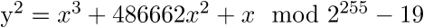
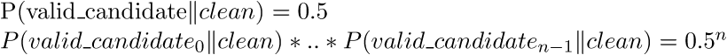
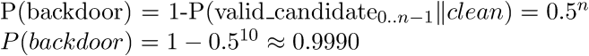

## Detecting an asymmetric Curve25519 backdoor in RSA key generation algorithms

>Copyright (C) 2015 - Jos Wetzels
>
>See the file 'LICENSE' for copying permission.

While working on some forthcoming research on cryptographic backdoors i came across an interesting [asymmetric backdoor designed to subvert RSA key generation algorithms](https://gist.github.com/ryancdotorg/9bd3873e488740f86ebb) by Ryan Castellucci. The backdoor is particularly interesting because unlike backdoors which subvert key generation by weakening the composite public modulus (eg. choosing prime numbers too close to eachother, choosing a common prime factor with pre-factored moduli, subverting the CSPRNG alltogether, etc.) it is asymmetric in the sense that it can only be used by an attacker posessing the [Curve25519](https://en.wikipedia.org/wiki/Curve25519) private key corresponding to a Curve25519 public key embedded in the backdoor thus ensuring exclusive access and [confidentiality](https://en.wikipedia.org/wiki/Information_security#Confidentiality) for the attacker. The backdoor embeds an ephemeral Curve25519 public key which is used in conjunction with the attacker's private key to perform an ECDH key exchange to establish a shared secret with the backdoor which is used as a seed for the prime number PRNG and thus allows PRNG state reconstruction and thus public modulus factorization. The detailed workings of the backdoor are covered by [Scratch](http://kukuruku.co/hub/infosec/backdoor-in-a-public-rsa-key) and [Alfonso De Gregorio](http://conference.hitb.org/hitbsecconf2015ams/wp-content/uploads/2014/12/WHITEPAPER-The-illusoryTLS-Asymmetric-Backdoor.pdf). 

While it does guarantee confidentiality it does not, however, guarantee indistinguishability and as such can be discovered by a third party with *blackbox* access to a key generation algorithm suspected to be backdoored in this fashion. The reason why it does not guarantee indistinguishability (noted as well by [De Gregorio](http://conference.hitb.org/hitbsecconf2015ams/wp-content/uploads/2014/12/WHITEPAPER-The-illusoryTLS-Asymmetric-Backdoor.pdf)) is because the ephemeral Curve25519 public key embedded in the public modulus of the backdoored RSA public key can be distinguished from a uniform random string. As noted [elsewhere](https://www.imperialviolet.org/2013/12/25/elligator.html) [Curve25519 points](http://elligator.cr.yp.to/elligator-20130828.pdf) can be distinguished from uniform random strings by virtue of the fact that they lie on the curve. Given a Curve25519 public key, which consists of the 256-bit x-coordinate of an *(x,y)* point on the curve, the probability that it is an x-coordinate corresponding to a valid curve-point is 1 while for a uniform random string this probability is 0.5. This thus allows for a distinguishing attack on part of a third party collecting **n** public keys generated by a *blackbox* key generation algorithm.

### Distinguishing Curve25519 public keys from uniform random strings

Given a 256-bit string we can confirm whether it is a valid x-coordinate to a point on Curve25519 by checking whether evaluating the equation:



Yields a [quadratic residue](https://en.wikipedia.org/wiki/Quadratic_residue) (ie. is congruent to a perfect square modulo the prime field characteristic). We can check whether this is the case by evaluating the equation over the Curve25519 prime field and (since we are dealing with a field of prime characteristic) using the [Tonelli-Shanks algorithm](https://en.wikipedia.org/wiki/Tonelli–Shanks_algorithm) to obtain its modular square root. If the square of this modular square root equals the equation's result we know it is congruent to a perfect square and hence *x* is a valid x-coordinate for a point on the curve. For Curve25519 public keys this will always yield true while for arbitrary 256-bit strings this will only yield true with probability 0.5.

We can use the following python code to perform this check:

```python
from Crypto.Util import number

# Curve25519 is defined over prime field defined by p = 2^255 - 19
CURVE_P = (2**255 - 19)

# Compute Legendre symbol a|p
def legendre_symbol(a, p):
    ls = pow(a, (p - 1) / 2, p)
    return -1 if ls == p - 1 else ls

# Compute modular square root using Tonelli-Shanks algorithm
# Taken from http://samuelkerr.com/?p=431
def modular_sqrt(a, p):
    # Simple cases
    if legendre_symbol(a, p) != 1:
        return 0
    elif a == 0:
        return 0
    elif p == 2:
        return n
    elif p % 4 == 3:
        return pow(a, (p + 1) / 4, p)

    # Partition p-1 to s * 2^e for an odd s (i.e. reduce all the powers of 2 from p-1)
    s = p - 1
    e = 0
    while s % 2 == 0:
        s /= 2
        e += 1

    # Find some 'n' with a legendre symbol n|p = -1.
    n = 2
    while legendre_symbol(n, p) != -1:
        n += 1

    # x is a guess of the square root that gets better with each iteration.
    # b is the "fudge factor"
    # g is used for successive powers of n to update both a and b
    # r is the exponent - decreases with each update
    x = pow(a, (s + 1) / 2, p)
    b = pow(a, s, p)
    g = pow(n, s, p)
    r = e

    while True:
        t = b
        m = 0
        for m in xrange(r):
            if t == 1:
                break
            t = pow(t, 2, p)

        if m == 0:
            return x

        gs = pow(g, 2 ** (r - m - 1), p)
        g = (gs * gs) % p
        x = (x * gs) % p
        b = (b * g) % p
        r = m

# Evaluate curve over candidate x-coordinate
def do_curve(x):
	return ((x**3 + 486662*(x**2) + x) % CURVE_P)

# Determines whether a candidate x-coordinate belongs to a valid point (x,y) on Curve25519
def is_on_curve(x_candidate):
	x = number.bytes_to_long(x_candidate[::-1])
	y2 = do_curve(x)
	y = modular_sqrt(y2, CURVE_P)
	return ((y**2 % CURVE_P) == y2)
```

### Determining backdoor presence

We can use this fact to determine the presence of this particular backdoor as follows. Consider we have *n* public keys generated by a suspicious key generation algorithm. From each of those public keys we will extract a *candidate* ephemeral Curve25519 public key from the RSA public modulus. If any of these *candidate* keys proves not to be a valid curve x-coordinate we can rule out the presence of the backdoor with certainty (since all embedded public keys are valid coordinates). If, however, all *candidate* keys are valid curve x-coordinates we are either dealing with the backdoor or with a (statistical anomaly of a) 'clean' key generation algorithm. For the latter case we have the conditional probability:



Hence if we collect *n = 10* RSA public keys from a suspect key generation algorithm and all of them pass the curve test the probality they were **not** generated as the result of a statistical anomaly on part of a clean algorithm is:



Which seems sufficient to rule out statistical anomalies with some confidence.

### Demonstration

I have uploaded [Castellucci's backdoor script](https://github.com/samvartaka/crypto_backdoors/blob/master/rsa_curve25519/rsabd.py), [my backdoor detecton script](https://github.com/samvartaka/crypto_backdoors/blob/master/rsa_curve25519/detectbd.py) and several test certificates (those starting with the prefix *poc* are generated by the backdoor, those with the prefix *clean* by openssl) [here](https://github.com/samvartaka/crypto_backdoors/tree/master/rsa_curve25519). When executed it looks like this:

```bash
$python detectbd.py poc
[+]RSA public keys generated by backdoor with probability 0.999023
$python detectbd.py clean
[+]RSA public keys generated by backdoor with probability 0.000000
```

### Backdoor improvements

An improvement to Castellucci's backdoor design was offered by [De Gregorio](http://illusorytls.com/) offering confidentiality, indistinguishability and forward secrecy properties among others and his [HITB talk whitepaper](http://conference.hitb.org/hitbsecconf2015ams/wp-content/uploads/2014/12/WHITEPAPER-The-illusoryTLS-Asymmetric-Backdoor.pdf) is worth checking out.